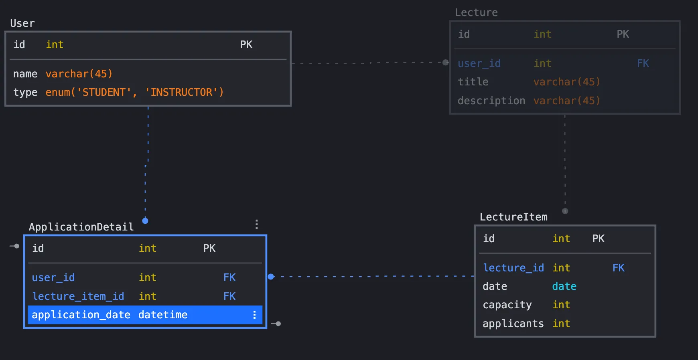

># ERD

---

># 테이블 정의

1. **User 테이블**: 사용자
    - `id`: 사용자 ID
    - `name`: 사용자 이름
    - `type`: 사용자 타입
        - `student`: 학생
        - `instructor`: 강사
2. **Lecture 테이블**: 특강 정보
    - `id`: 특강 ID
    - `userId`: 사용자 ID (FK)
    - `title`: 특강 제목
    - `description`: 설명
3. **LectureItem 테이블**: 강의 정보
    - `id`: 강의 ID
    - `lectureId`: 특강 ID (FK)
    - `date`: 특강 날짜
    - `capacity`: 총 참석인원 수
    - `applicants`: 신청한 인원 수
4. **ApplicationDetail 테이블**: 강의 신청 내역
    - `id`: 신청 내역 ID
    - `userId`: 사용자 ID (FK)
    - `lectureItemId`: 강의 ID (FK)
    - `registrationDate`: 신청일

---

># 테이블 관계
> 
- **User** —— 1:N —— **Lecture** : 사용자는 여러 특강을 등록할 수 있다.
- **Lecture** —— 1:N —— **LectureItem** : 특강에는 여러 강의가 포함될 수 있다.
- **User** —— 1:N —— **ApplicationDetail** : 사용자는 여러 강의 신청 내역을 가질 수 있다.
- **LectureItem** —— 1:N —— **ApplicationDetail** : 강의에는 여러 강의 신청 내역이 포함될 수 있다.

---

># 설명

1. **특강 신청 API**:
    - **ApplicationDetail** 테이블에 새로운 신청 내역을 추가.
    - 단, **ApplicationDetail** 테이블에 동일한 `userId`와 `lectureItemId`가 이미 있는지 확인한 후 신청.
    - 또한 **LectureItem** 테이블의 `applicants`가 `capacity`를 초과하지 않도록 체크.
2. **특강 선택 API**:
    - **LectureItem** 테이블에서 `date`가 주어진 날짜에 해당하는 특강 목록 조회.
    - `applicants`가 `capacity` 미만이어야 하며, **ApplicationDetail** 테이블에 해당 `userId`와 `lectureItemId`가 없어야 함.
3. **특강 신청 완료 목록 조회 API**:
    - 특정 `userId`로 신청 완료된 특강을 **ApplicationDetail** 테이블에서 조회.
    - 해당 사용자의 신청 목록을 **Lecture**, **LectureItem** 테이블과 조인하여, `Lecture`의 정보를 포함한 목록을 반환.
    - 조인은 데이터베이스가 아닌 도메인에서 처리.
